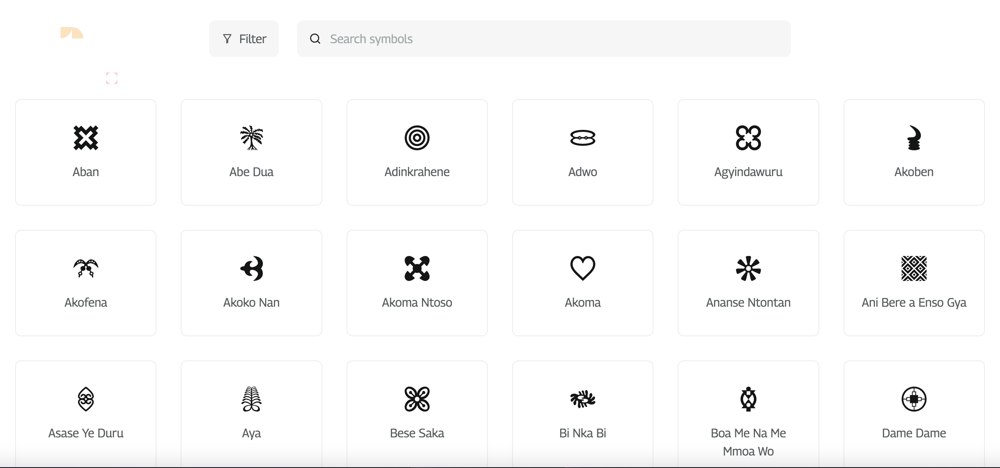

## Adinkra Icons For Flutter

Adinkra Icons is a set of visual symbols for designers and developers. These symbols represent a historical and philosophical significance originally printed on cloth which royals wore to important ceremonies. Originating from the Gyaman people of Ghana and la Côte d’Ivoire, the symbols have assumed global importance and are now found in logos, clothes, furniture, sculpture, earthenware pots, and many others.

## Icons



## Install

Add `adinkra_icons` package into your project's `pubspec.yaml`.

```yaml
dependencies:
  flutter:
    sdk: flutter
  adinkra_icons: # Latest version
```

Import the package into your dart file

```dart
import 'package:adinkra_icons/adinkra_icons.dart';
```

## Usage

```dart
class MyExampleWidget extends StatelessWidget {
  @override
  Widget build(BuildContext context) {
    return AdinkraIcon(
      AdinkraIcons.adinkrahene,
      color: Colors.red,
      size: 50,
    );
  }
}
```
